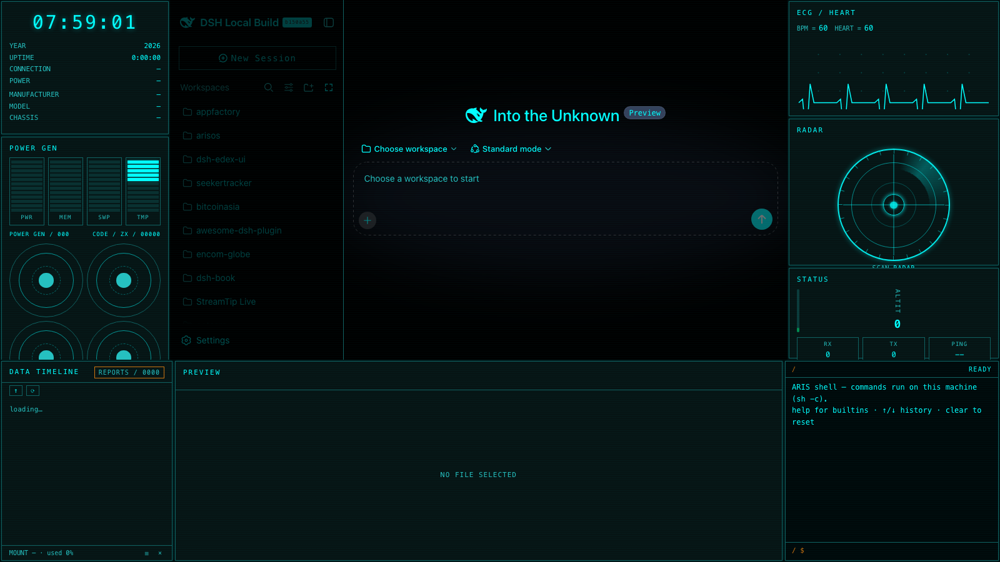

# dsh-edex-xry-ui

**DeepSeek Harness eDEX shell plugin — XRY/B1 medical-HUD skin.** A sci-fi
X-ray body-scanner terminal overlay for the DSH web GUI, rebuilt from the
`Screenshot 2026-08-24 at 21.18.41.png` reference: cyan-on-near-black neon
frames, a rotating radar scan disc, an ECG heartbeat monitor, power-gen
energy-cell meters, and a DATA TIMELINE scan-log — wrapped around the original
UI.



## Features

- **Right bar** — the reference's signature stack:
  - **ECG / HEART** — a live vital-sign waveform (grid dots + cyan trace,
    `BPM =` / `HEART =` readouts driven by network throughput)
  - **RADAR** — the featured widget: a circular scan disc with concentric
    rings, crosshair, rim tick marks, center target reticle, and a rotating
    conic-gradient sweep (replaces the WORLD VIEW globe)
  - **STATUS** — ALTIT value blocks + a vertical green meter (the reference's
    status column)
- **Left bar** — the reference's lower modules:
  - **POWER GEN** — four stacked energy-cell columns (PWR/MEM/SWP/TMP) plus a
    2×2 circular knob cluster, wired to live panel data
  - INFO (clock/specs) and PROCESSES remain, recolored to the HUD palette
- **Bottom panel** — **DATA TIMELINE** scan-log table (NO. / DATA TIMELINE /
  DATA:XG / RESULT columns, DONE green / RIGHT dim / ERROR red, orange REPORTS
  frame) replacing the file browser, alongside the PREVIEW editor and the host
  TERMINAL
- **Center region** — the original DSH working area (sidebar, conversation,
  composer) shows through the shell untouched
- **Cyan-on-near-black skin** — `#03ffff` accent, `#106060` thin 1px square
  borders with subtle glow, token overrides recoloring the original UI
- **Terminal-styled composer** — flattened input, block caret, `~/<workspace>`
  path prompt
- **Workspace-follow** — the timeline panel and prompt track the active
  conversation's workspace

## Installation

The plugin is published to npm as `@danielng23/dsh-edex-xry-ui`. From the
harness checkout:

```sh
pnpm dsh plugin --profile web add @danielng23/dsh-edex-xry-ui
pnpm dsh web   # serves the eDEX shell over the default GUI
```

To run the local checkout instead of the npm release (for development), add
the bundle with a `file:` path:

```sh
pnpm dsh plugin --profile web add file:/path/to/dsh-edex-xry-ui/packages/bundle
```

## Development

See [LOCAL_DEVELOPMENT.md](LOCAL_DEVELOPMENT.md) for the full build, install,
and iteration workflow. The widget architecture for the shell bars is
documented in [WIDGETS.md](WIDGETS.md). The `analysis.json` / `analysis.md`
in this repo are the reference analysis (colors, border language, widget
reconciliation) that produced this variant.

## Packages

| Package | Host/Client | Description |
|---|---|---|
| `packages/bundle` | — | Installable bundle (`cordis.patch.yml`) |
| `packages/ui-edex` | client | The eDEX shell frame and all panels |
| `packages/ui-theme-terminal` | client | Appearance → Terminal theme row |
| `packages/host/system-metrics` | host | System telemetry RPC + file read/write + `runCommand` shell execution |

## License

MIT
